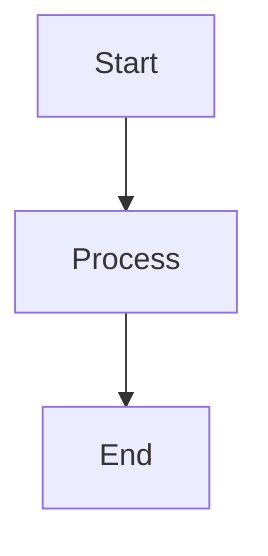
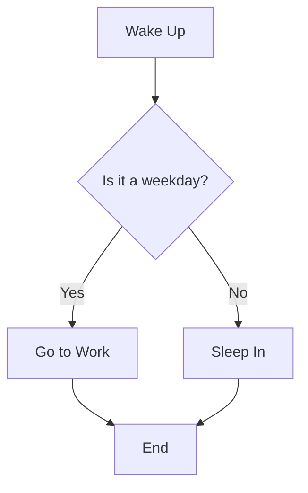
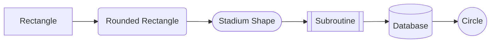
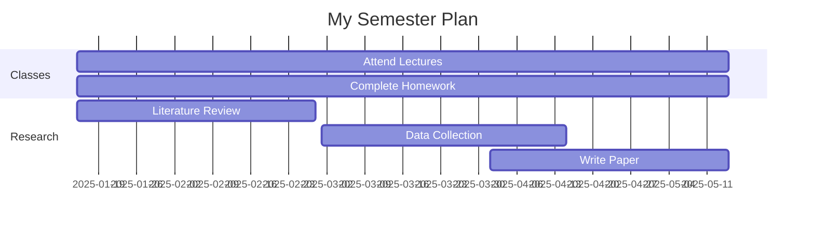
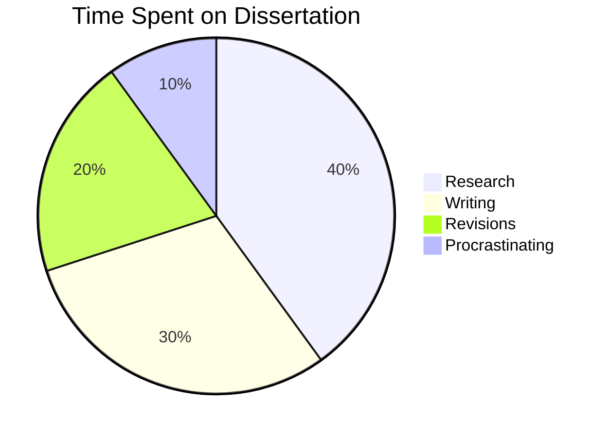
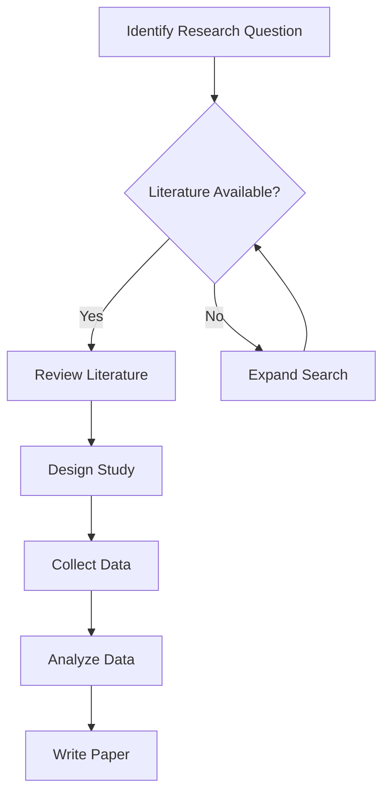
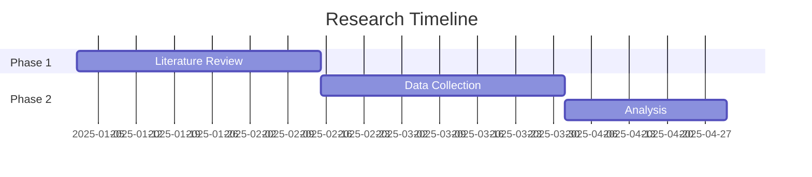
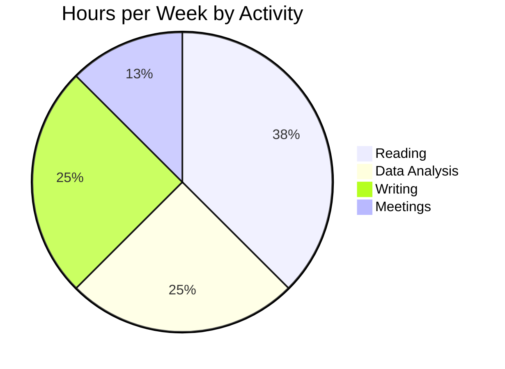
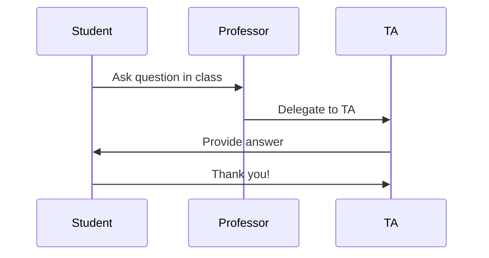

## Step 1: Simple Flowcharts

*Welcome to "Mermaid Diagrams in Markdown"! Let's start with a simple flowchart.*

Flowcharts are one of the most common diagram types in Mermaid. They help visualize processes, decisions, and workflows. Flowcharts are enclosed in a code block with the `mermaid` language tag.

### Example:
````md

````

How it looks:
````mermaid
graph TD
    A[Start] --> B[Process]
    B --> C[End]
````

### Basic Syntax:
- `graph TD` means "graph, top-down direction" (you can also use `LR` for left-right, `BT` for bottom-top, or `RL` for right-left)
- Nodes are defined with letters/numbers and can have text in brackets: `A[Text Here]`
- Arrows connect nodes: `A --> B` means "A points to B"

### :keyboard: Activity: Create your first flowchart

1. Edit the `mermaid_practice.md` file you created.
2. Create a simple flowchart about a process you do regularly (e.g., making coffee, getting ready for class, starting homework).
3. Use at least 3 nodes connected with arrows.
4. Use the **Preview** tab to check your diagram.
5. Commit your changes.

---

## Step 2: Adding Decisions (Diamond Shapes)

*Great job with your first flowchart! Now let's add decision points.*

Decision points in flowcharts are shown as diamond shapes and typically represent yes/no or true/false questions.

### Example:
````md

````

How it looks:
````mermaid
graph TD
    A[Wake Up] --> B{Is it a weekday?}
    B -->|Yes| C[Go to Work]
    B -->|No| D[Sleep In]
    C --> E[End]
    D --> E
````

### Decision Syntax:
- Use curly braces for diamond shapes: `B{Question?}`
- Label your arrows with text in pipes: `B -->|Yes| C`

### :keyboard: Activity: Add decisions to your flowchart

1. Edit your `mermaid_practice.md` file.
2. Add at least one decision point (diamond shape) to your flowchart.
3. Make sure the decision has at least two possible paths.
4. Label the arrows coming from your decision.
5. Use the **Preview** tab to check your formatting.
6. Commit your changes.

---

## Step 3: Different Node Shapes

*Excellent work with decisions! Let's explore different node shapes.*

Mermaid supports various node shapes to help distinguish different types of steps in your process.

### Example:
````md

````

How it looks:
````mermaid
graph LR
    A[Rectangle] --> B(Rounded Rectangle)
    B --> C([Stadium Shape])
    C --> D[[Subroutine]]
    D --> E[(Database)]
    E --> F((Circle))
````

### Shape Syntax:
- `[Text]` - Rectangle (default)
- `(Text)` - Rounded rectangle
- `([Text])` - Stadium shape
- `[[Text]]` - Subroutine
- `[(Text)]` - Cylinder/Database
- `((Text))` - Circle
- `{Text}` - Diamond (decision)

### :keyboard: Activity: Use different shapes

1. Edit your `mermaid_practice.md` file.
2. Create a new flowchart (or modify your existing one) that uses at least 3 different node shapes.
3. Try to choose shapes that make sense for your process (e.g., use a database shape for data storage).
4. Use the **Preview** tab to check your formatting.
5. Commit your changes.

---

## Step 4: Gantt Charts for Timelines

*Great job with flowcharts! Now let's create a Gantt chart for project planning.*

Gantt charts show tasks over time and are perfect for project timelines, semester planning, or research milestones.

### Example:
````md

````

How it looks:
````mermaid
gantt
    title My Semester Plan
    dateFormat YYYY-MM-DD
    section Classes
    Attend Lectures     :2025-01-15, 2025-05-15
    Complete Homework   :2025-01-15, 2025-05-15
    section Research
    Literature Review   :2025-01-15, 2025-02-28
    Data Collection     :2025-03-01, 2025-04-15
    Write Paper         :2025-04-01, 2025-05-15
````

### Gantt Chart Syntax:
- Start with `gantt` and a `title`
- Set `dateFormat` (common format: `YYYY-MM-DD`)
- Use `section` to group related tasks
- Tasks follow the format: `Task Name :start-date, end-date`

### :keyboard: Activity: Create a timeline

1. Edit your `mermaid_practice.md` file.
2. Create a Gantt chart for an upcoming project, your semester, or a research timeline.
3. Include at least 2 sections with 2-3 tasks each.
4. Use realistic dates (you can use dates in the future).
5. Use the **Preview** tab to check your formatting.
6. Commit your changes.

---

## Step 5: Pie Charts for Data

*Excellent work with timelines! Let's visualize some data with a pie chart.*

Pie charts are great for showing proportions and percentages.

### Example:
````md

````

How it looks:
````mermaid
pie title Time Spent on Dissertation
    "Research" : 40
    "Writing" : 30
    "Revisions" : 20
    "Procrastinating" : 10
````

### Pie Chart Syntax:
- Start with `pie title Your Title Here`
- Each slice: `"Label" : value`
- Values are relative (they don't need to sum to 100)

### :keyboard: Activity: Create a pie chart

1. Edit your `mermaid_practice.md` file.
2. Create a pie chart showing how you spend your time in a week, how you divide your research focus, or budget allocations.
3. Include at least 4 categories.
4. Use the **Preview** tab to check your formatting.
5. Commit your changes.

---

## Step 6: Create Your Diagram Showcase

*Great job learning various Mermaid diagram types! For the final step, let's create a showcase page.*

Create a page that demonstrates different types of Mermaid diagrams. This could be for a project README, a research workflow, or a course planning document.

Your showcase should include:

1. A descriptive title and introduction
2. At least 3 different diagram types (flowchart, Gantt chart, pie chart, etc.)
3. Brief explanations of what each diagram represents
4. Professional formatting

### Example Structure:
````md
# My Research Project Workflow

This document outlines the workflow and timeline for my research project on [Topic].

## Research Process


## Project Timeline


## Time Allocation

````

### :keyboard: Activity: Create your diagram showcase

1. Edit your `mermaid_practice.md` file or create a new file called `mermaid_showcase.md`.
2. Create a showcase page following the structure above, but with your own content.
3. Include at least 3 different types of Mermaid diagrams.
4. Add explanatory text between diagrams.
5. Use the **Preview** tab to check your formatting.
6. Commit your changes.

---

## Bonus: Sequence Diagrams

*Want to try something more advanced? Sequence diagrams show interactions over time.*

Sequence diagrams are perfect for showing how different parts of a system (or people) interact.

### Example:
````md

````

How it looks:
````mermaid
sequenceDiagram
    participant Student
    participant Professor
    participant TA
    Student->>Professor: Ask question in class
    Professor->>TA: Delegate to TA
    TA->>Student: Provide answer
    Student->>TA: Thank you!
````

### Sequence Diagram Syntax:
- Start with `sequenceDiagram`
- Define participants: `participant Name`
- Show interactions: `A->>B: Message text`
- Use `-->>` for dashed lines (responses)

### :keyboard: Bonus Activity: Try a sequence diagram

1. Edit your `mermaid_practice.md` file.
2. Create a sequence diagram showing an interaction (e.g., ordering food, submitting homework, peer review process).
3. Include at least 3 participants.
4. Commit your changes.

---

## Tips for Success

- **Use the Mermaid Live Editor** ([mermaid.live](https://mermaid.live/)) to test complex diagrams before adding them to your files
- **Keep it simple** - Start with basic diagrams and add complexity gradually
- **Use meaningful labels** - Your diagrams should be self-explanatory
- **Check the preview often** - Mermaid syntax can be finicky, so preview early and often
- **Explore the documentation** - Mermaid has many more diagram types and options to explore!

## Additional Diagram Types to Explore

- **Class Diagrams** - For showing object-oriented programming structures
- **State Diagrams** - For showing system states and transitions
- **Entity Relationship Diagrams** - For database design
- **User Journey** - For mapping user experiences
- **Git Graph** - For visualizing version control branching

Check out the [Mermaid documentation](https://mermaid.js.org/) for examples and syntax guides for these diagram types!
